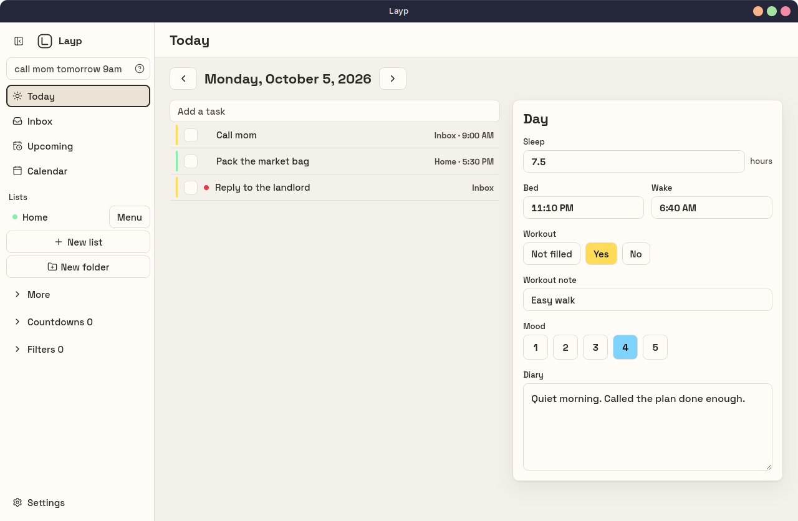
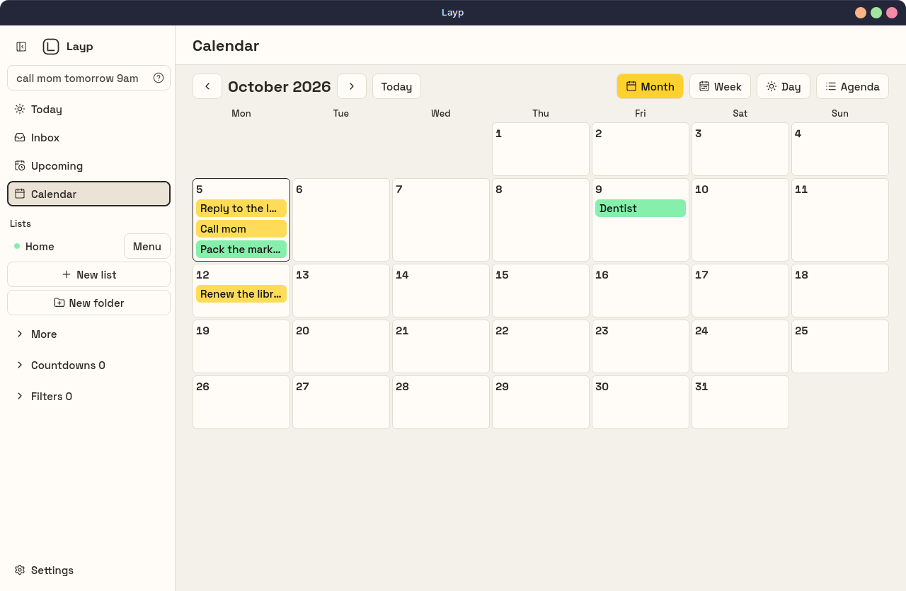
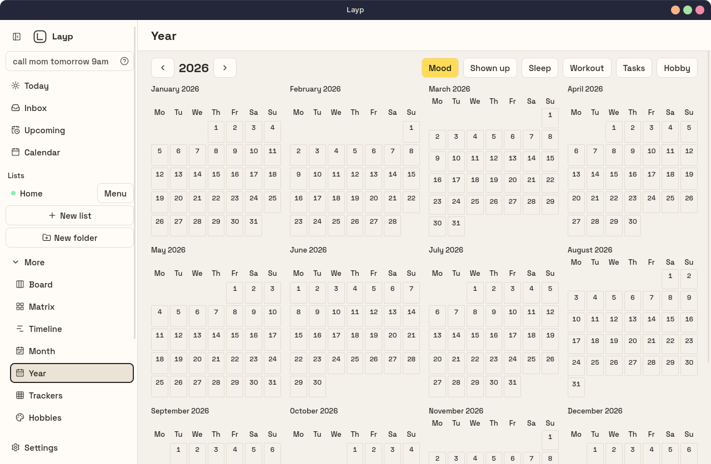

<p align="center">
  
</p>

<h1 align="center">Layp</h1>

<p align="center">
  A local desktop planner for Linux.<br>
  Tasks, a calendar, and a day record in one SQLite file.
</p>

<p align="center">
  
</p>

Layp is an installed program with its own window. There is no account, no server, and no sync. The database stays on this computer. A backup is a copy of that file.

## Screens

<p align="center">
  
</p>

<p align="center">
  
</p>

The sidebar opens on Today, Inbox, Upcoming, and Calendar. Lists and folders sit under those. More holds the rest:

| Screen | What it is for |
| --- | --- |
| Today | Tasks for the day, plus the diary, sleep, and workout line |
| Inbox | Tasks that do not have a list yet |
| Upcoming | What is scheduled next |
| Calendar | The month, with tasks on their days |
| Board | One list as columns |
| Matrix | Important and urgent |
| Timeline | The week as columns |
| Month | The month spread and the day page |
| Year | The year, a day at a time |
| Trackers | Checks and counts you keep |
| Hobbies | Time spent, not a daily debt |
| Focus | A work timer and a break |
| Stats | Bars, a line, or a notebook, for 7, 28, or 365 days |
| Settings | Theme, clock, tray, backup, and About |

Type a task in the sidebar field. `call mom tomorrow 9am` sets the title, the day, and the time. The question mark next to the field lists the words Layp understands.

## Install

The `.deb` for Debian, Ubuntu, and Linux Mint is attached to the [0.1.0 release](https://github.com/dj-secq/layp/releases/tag/v0.1.0).

```sh
curl -LO https://github.com/dj-secq/layp/releases/download/v0.1.0/Layp_0.1.0_amd64.deb
sudo apt install ./Layp_0.1.0_amd64.deb
```

Installing it adds Layp to the app menu. The package is section `utils`, priority `optional`. The desktop entry is a Productivity app. Its keywords are tasks, planner, calendar, journal, todo, and focus.

Build the package from this repo:

```sh
cd app
npm install
npm run tauri build
```

The package is written to `app/src-tauri/target/release/bundle/deb/`. The AppImage is under `bundle/appimage/`.

## Develop

Node 22 and a Rust toolchain are required, plus the WebKitGTK and GTK libraries Tauri uses on Linux.

```sh
cd app
npm install
npm test
npm run tauri dev
```

`npm run tauri dev` opens the Layp window.

## License

[MIT](LICENSE)
